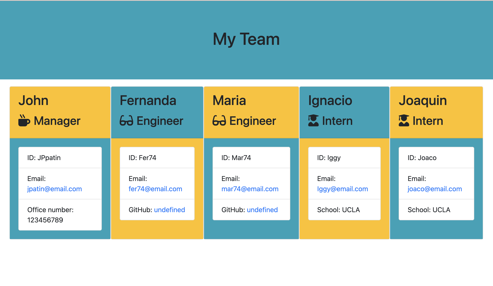
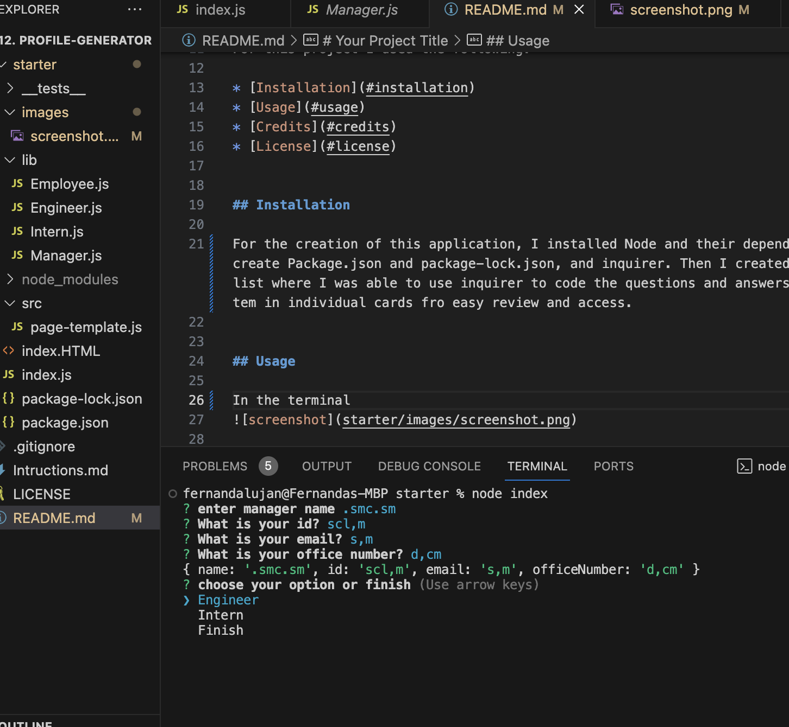

# profile-generator
# Your Project Title

## Description 

The task requested was using the given starter code and convert it into a working Node.js command-line application, develope an application that will take in information about employees on a software engineering team, then generates an HTML webpage that displays summaries for each person with a quick access to their emails and GitHub profiles.

https://mafer74.github.io/profile-generator/

## Table of Contents (Optional)

For this project I used the following:

* [Installation](#installation)
* [Usage](#usage)
* [Credits](#credits)
* [License](#license)

## Installation

For the creation of this application, I installed Node and their dependencies, and create Package.json and package-lock.json, and inquirer. Then I created the employee list where I was able to use inquirer to code the questions and answers to deploy the tem in individual cards fro easy review and access.

## Usage 

In the terminal you run node index, then it will prompt questions that the user has to fill, and choose the different employees, when finished the application will generate an HTML that will display the cards with all the information of each employee.

## Credits

I received the help from the tutor (Bobbi Tarkani) and a ta (Kayvon), 

## License

for this particular project i used MIT license.

## Tests

Tests were done in te terminal using node

© 2023 edX Boot Camps LLC. Confidential and Proprietary. All Rights Reserved.
